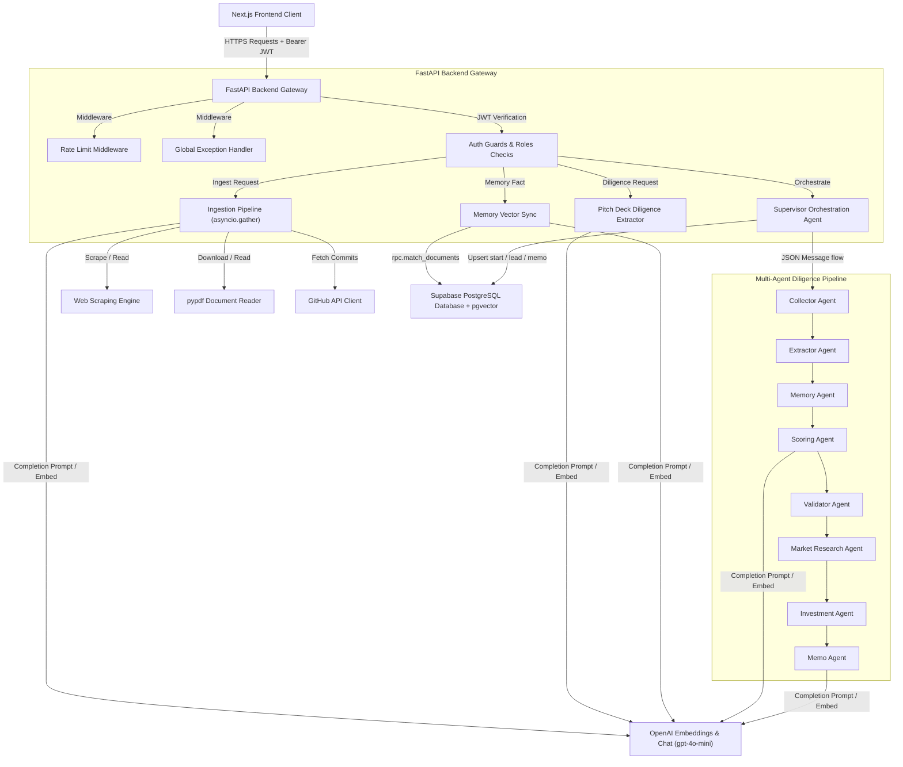

# VC Brain — Venture Capital Intelligence Platform

VC Brain is an AI-powered venture capital intelligence platform supporting secure investor authentication, concurrent ingestion data pipelines, semantic pgvector searching, trust claims checklists verification, multi-agent cooperative deal diligence pipelines, and visual deal-flow dashboards.

---

## 1. System Architecture



---

## 2. Environment Variables

### Backend Configuration (`backend/.env`)

```ini
# FastAPI Security
CORS_ORIGINS=["http://localhost:3000", "https://vc-brain.vercel.app"]

# OpenAI API credentials
OPENAI_API_KEY=your_openai_api_key_here
OPENAI_CHAT_MODEL=gpt-4o-mini
OPENAI_EMBEDDING_MODEL=text-embedding-3-small

# Supabase PostgreSQL + pgvector
SUPABASE_URL=https://your-project.supabase.co
SUPABASE_SERVICE_ROLE_KEY=your_supabase_service_role_key_here
```

### Frontend Configuration (`.env.local`)

```ini
# API Connection
NEXT_PUBLIC_API_URL=http://localhost:8000

# Supabase Auth configuration
NEXT_PUBLIC_SUPABASE_URL=https://your-project.supabase.co
NEXT_PUBLIC_SUPABASE_ANON_KEY=your_supabase_anon_key_here
```

---

## 3. Production Deployment

### Docker Compose Local Deployment

To compile and spin up the complete frontend, backend, and proxy network locally:

```bash
# Build and run containers in detached mode
docker compose up --build -d

# Verify containers are running
docker compose ps

# Inspect backend logging outputs
docker compose logs -f backend
```
*   **Next.js Frontend**: Accessible on [http://localhost:3000](http://localhost:3000)
*   **FastAPI API Docs**: Accessible on [http://localhost:8000/docs](http://localhost:8000/docs)
*   **Health Telemetry Route**: Accessible on [http://localhost:8000/health](http://localhost:8000/health)

### Cloud Deployments

#### Frontend (Vercel)
The Next.js client is optimized for deployment to Vercel:
1. Connect repository to Vercel.
2. Select **Next.js** framework.
3. Configure `NEXT_PUBLIC_API_URL` (pointing to your deployed FastAPI Gateway) and Supabase client credentials in Environment variables.
4. Click **Deploy**.

#### Backend (Railway)
The FastAPI container automatically deploys to Railway using the included `railway.json` manifest:
1. Create a new service on Railway from GitHub repository.
2. Configure environment keys (`OPENAI_API_KEY`, `SUPABASE_URL`, `SUPABASE_SERVICE_ROLE_KEY`, `PORT`).
3. Railway automatically builds the container using [backend/Dockerfile](file:///d:/hacknation/backend/Dockerfile).

---

## 4. API Security Controls

1.  **Rate Limiting**: Protects all paths against excessive bot scraping and brute force requests using a client IP bucket cache middleware (`RateLimitMiddleware`). Max 100 requests per IP per minute.
2.  **Auth Guards**: Decodes JWT authentication headers matching Supabase authentication signatures before allowing execution.
3.  **Role Verification**: Restricts access to sensitive routes (e.g. changing investor roles) to admins using the `require_admin` dependency.
4.  **Error Isolation**: intercepts unhandled python errors globally (`GlobalExceptionHandlerMiddleware`), logs backend stack traces for developers, and outputs clean, standard JSON errors to public clients to prevent code leakages.
